## ECPS v1.0: Embodied Cognition Protocol Stack Design Specification

**Document Version:** 1.0.0
**Date:** June 17, 2025
**Authors:** Manish Bhatt

---

**Table of Contents**

1.  Introduction
    1.1. Purpose
    1.2. Scope
    1.3. Goals
    1.4. Audience
    1.5. Normative References
2.  High-Level Architecture
    2.1. ECPS Layered Model
    2.2. End-to-End Data Flow Overview
3.  Core Components & Protocols
    3.1. Physical / Link Layer (L0/L1)
    3.2. Transport Layer (L2)
        3.2.1. DDS/RTPS Binding
        3.2.2. gRPC/HTTP-2 Binding
        3.2.3. MQTT 5 Binding
    3.3. Serialization & Event Envelope Layer (L3)
        3.3.1. Protocol Buffers (Protobuf)
        3.3.2. CloudEvents 1.0
    3.4. Observability Layer (L4)
        3.4.1. OpenTelemetry (OTLP) Integration
    3.5. Perception Data Layer (L5)
        3.5.1. ROS 2 `sensor_msgs/*`
        3.5.2. Latent Tensor Protocol (LTP)
    3.6. Cognition Layer (L6)
        3.6.1. Model Context Protocol (MCP)
        3.6.2. Memory Exchange Protocol (MEP)
        3.6.3. Agent-to-Agent (A2A) (Optional)
    3.7. Actuation Layer (L7)
        3.7.1. Embodied Action Protocol (EAP)
        3.7.2. Actuation Bindings (ROS 2 Actions, OPC UA Robotics)
4.  Cross-Cutting Concerns
    4.1. Common Envelope Rules
    4.2. Deterministic Replay Mechanism
    4.3. Security Architecture
    4.4. Versioning & Compatibility Strategy
5.  Conformance Profiles
    5.1. Edge-Lite Profile
    5.2. Standard Profile
    5.3. Cloud-Fleet Profile
    5.4. Test Vectors & Validation
6.  Appendices
    6.1. JSON EAP Example
    6.2. Detailed Protocol Buffer Definitions
    6.3. Glossary

---

## 1. Introduction

### 1.1. Purpose

This document formalizes ECPS v1.0 (Embodied Cognition Protocol Stack), a complete, transport-agnostic protocol stack designed to facilitate sophisticated communication between AI-agent/world-model cognitive cores and physical or simulated robotic systems. It provides a deterministic, replayable, and auditable communication backbone, enabling AI agents to perceive, remember, reason, and act without reliance on external "oracles."

### 1.2. Scope

ECPS v1.0 defines the interfaces, message formats, and behavioral contracts for agent-robot interaction. It re-uses existing, battle-tested robotics and cloud standards for lower-level concerns (transport, serialization, observability, security) and introduces four new, narrowly defined envelopes (MCP, LTP, MEP, EAP) only where novel "glue" for cognition is strictly necessary. This specification covers the full stack from physical link to cognitive and actuation layers.

### 1.3. Goals

* **Unify AI-agent ↔ robot communication:** Establish one deterministic, replayable contract for seamless interaction.
* **Maximize Reuse:** Leverage existing link, transport, observability, and security technologies, adding new definitions only when unavoidable.
* **Platform Agnostic:** Remain language-, OS-, and hardware-neutral, supporting diverse network environments (Wi-Fi, Ethernet, 5G, cloud WAN).
* **Clear Conformance:** Provide distinct conformance profiles and machine-readable test vectors to ensure interoperability and verifiable implementations.
* **Auditable Operations:** Enable end-to-end auditing of robot actions via hash-anchored action logs.

### 1.4. Audience

This document is intended for:
* Robotics engineers and developers implementing ECPS-compliant systems.
* AI/ML engineers designing agents that interact with physical robots.
* System architects planning large-scale robot deployments.
* Quality assurance teams verifying ECPS implementations.

### 1.5. Normative References

[R1] ROS 2 Quality-of-Service documentation (docs.ros.org)
[R2] OMG DDS-RTPS 2.5 spec (omg.org)
[R3] gRPC on HTTP-2 engineering notes (grpc.io)
[R4] CloudEvents 1.0 spec site & repo (cloudevents.io, github.com)
[R5] OpenTelemetry OTLP 1.7 spec (opentelemetry.io)
[R6] Protobuf vs JSON performance benchmark (auth0.com, reddit.com)
[R7] MQTT 5.0 OASIS standard (docs.oasis-open.org, oasis-open.org)
[R8] OPC UA Robotics Companion (VDMA) (opcfoundation.org, opcfoundation.org)
[R9] ROS 2 DDS QoS profile design article (design.ros2.org)
[R10] Real-time robot control with gRPC & Protobuf (Viam) (viam.com)

---

## 2. High-Level Architecture

ECPS is conceived as a modular, layered stack that bridges the gap between high-level AI cognition and low-level robot hardware control. It operates on the principle of minimal new definitions, preferring to integrate and standardize existing, robust technologies.

### 2.1. ECPS Layered Model

The ECPS architecture is structured into seven distinct layers, each building upon the services of the layer below it. This modularity allows for interchangeable implementations at different layers, provided the interfaces are maintained.

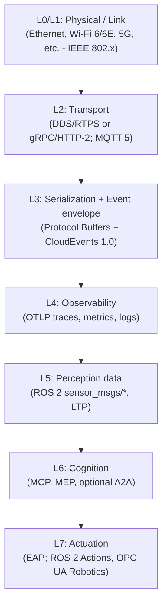

### 2.2. End-to-End Data Flow Overview

Data flow within ECPS is designed to support both real-time robot control loops and asynchronous cognitive processing. A single `CloudEvents id` is propagated through all layers, acting as a `trace_id` for end-to-end correlation via OpenTelemetry.

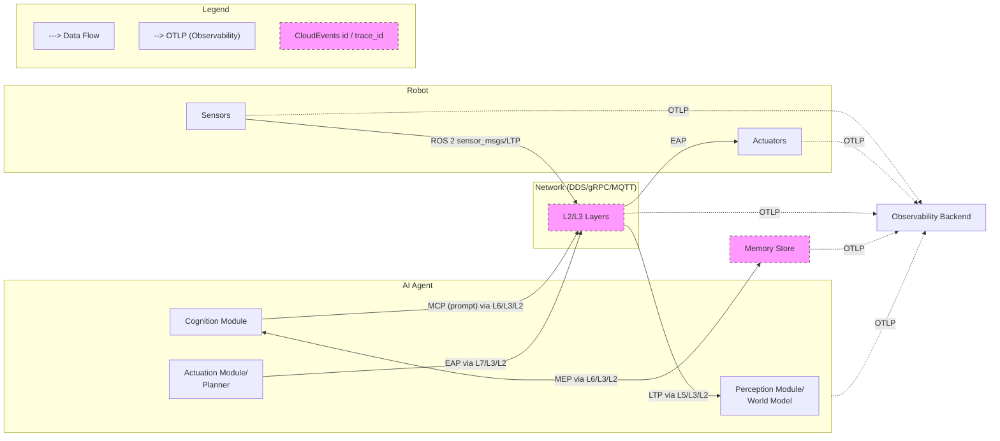

---

## 3. Core Components & Protocols

This section details each layer of the ECPS, specifying its purpose, standards, and the role of newly defined ECPS envelopes.

### 3.1. Physical / Link Layer (L0/L1)

* **Purpose:** Provides the fundamental physical and data link connectivity for communication between robot components and between robots and the cloud.
* **Mandatory Standard(s):** IEEE 802.x (e.g., Ethernet, Wi-Fi 6/6E), 5G.
* **Details:** ECPS is agnostic to the specific L0/L1 implementation, relying on standard networking hardware and drivers. Performance characteristics (latency, bandwidth) of the chosen link layer will directly impact the behavior of higher layers.

### 3.2. Transport Layer (L2)

The Transport Layer is responsible for reliable, ordered, and efficient data delivery across LAN and WAN. ECPS mandates the support of at least one of the following, with specific conformance profiles dictating which bindings are required.

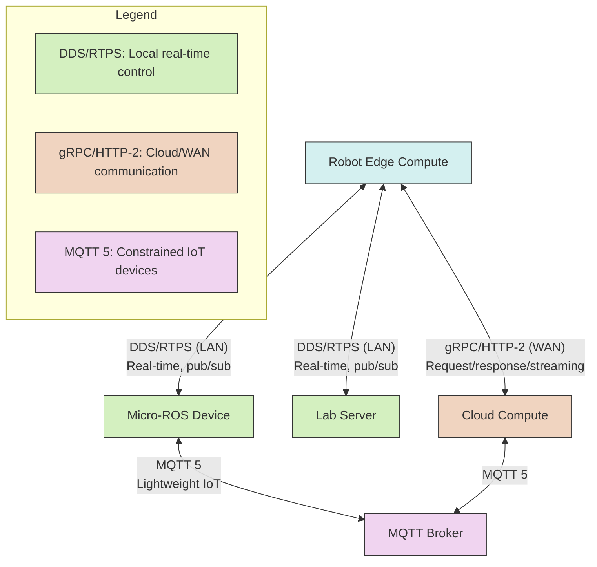

#### 3.2.1. DDS/RTPS Binding

* **Standard:** OMG DDS-RTPS 2.5 [R2]
* **Use-Case:** Predominantly used for real-time, local control, and high-frequency data streaming within a LAN environment (e.g., ROS 2 inter-node communication).
* **Protocol:** ECPS messages are encapsulated as DDS payloads.
* **QoS (Quality-of-Service):** Conforming implementations SHALL set Reliability and Durability QoS according to ROS 2 QoS documentation [R1] and the ROS 2 DDS QoS profile design [R9].
    * **Reliability:** `RELIABLE` for critical messages (e.g., EAP, MCP, MEP) ensuring delivery. `BEST_EFFORT` may be used for high-frequency, non-critical sensor data (e.g., raw camera frames if loss is acceptable).
    * **Durability:** `TRANSIENT_LOCAL` for messages that a late-joining reader should receive (e.g., last known robot state). `VOLATILE` for transient data.
    * **History:** `KEEP_LAST(N)` or `KEEP_ALL` as appropriate for message types. For EAP, `KEEP_LAST(4)` is specified [R9].

#### 3.2.2. gRPC/HTTP-2 Binding

* **Standard:** gRPC on HTTP-2 [R3]
* **Use-Case:** Preferred for cloud robot fleets, long-running operations, and request/response patterns over WAN connections. Supports streaming and back-pressure mechanisms.
* **Protocol:** ECPS messages are encapsulated as gRPC message payloads.
* **Streaming:** Conforming implementations SHALL use HTTP-2 streaming [R3] for continuous data flows (e.g., MEP queries, perception streams).
* **RPC Types:** Supports Unary, Server Streaming, Client Streaming, and Bidirectional Streaming RPCs as needed for different ECPS interactions (e.g., MEP `Query` as server streaming).

#### 3.2.3. MQTT 5 Binding

* **Standard:** MQTT 5.0 OASIS standard [R7]
* **Use-Case:** Permitted for constrained IoT devices and scenarios requiring lightweight, publish-subscribe communication, especially over potentially unreliable networks or for event-driven architectures.
* **Protocol:** ECPS messages are published as MQTT message payloads on defined topics.
* **QoS:** Conforming implementations SHALL use QoS 1+ [R7] for ensuring message delivery at least once.

### 3.3. Serialization & Event Envelope Layer (L3)

This layer standardizes how ECPS messages are structured and encoded for transport.

```mermaid
classDiagram
    class CloudEventEnvelope {
        id: "4d3a18e0-1f2a..."
        source: "urn:robot:arm1"
        type: "ecps.mcp.prompt"
        specversion: "1.0"
        datacontenttype: "application/cloudevents+protobuf"
        data: [binary]
    }
    
    class ProtobufMessage {
        <<ECPS Message (MCP)>>
        spec: "mcp/1.0"
        id: "4d3a18e0-1f2a..."
        prompt: "Move to coordinates..."
        tool_call: [Any]
        meta: {key: value}
    }
    
    CloudEventEnvelope *-- ProtobufMessage : contains
    
    note for CloudEventEnvelope "Standard CloudEvents attributes\nfor interoperability"
    note for ProtobufMessage "Protobuf-encoded message\nwith mirrored 'id' from CloudEvents"
    
    class AttributePropagation {
        <<Mirror>>
        CloudEvents.id → ECPS.id
        CloudEvents.source → trace context
        CloudEvents.type → message type
    }
    
    CloudEventEnvelope .. AttributePropagation
    AttributePropagation .. ProtobufMessage
```

#### 3.3.1. Protocol Buffers (Protobuf)

* **Standard:** Protocol Buffers [R6]
* **Purpose:** Provides a language-neutral, platform-neutral, extensible mechanism for serializing structured data. Chosen for its efficiency in speed and bandwidth compared to JSON [R6].
* **Encoding:** Binary Protobuf encoding MUST be offered for all ECPS messages. JSON encoding MAY be exposed for debugging purposes.
* **`ecps.proto`:** A single, normative Protobuf definition file encapsulates all ECPS message types (MCP, LTP, EAP) and nested structures (e.g., `RobotPose`, `GripperOp`). (See Appendix B for detailed Protobuf definitions).

#### 3.3.2. CloudEvents 1.0

* **Standard:** CloudEvents 1.0 [R4]
* **Purpose:** Defines common metadata for event data, enabling interoperability across different services, platforms, and programming languages.
* **Integration:** All ECPS envelopes (`MCP`, `LTP`, `MEP` service messages, `EAP`) copy or mirror CloudEvents' essential attributes: `id`, `source`, `type`, `specversion`. This ensures that a single trace ID flows from the genesis of an event (e.g., camera perception, user prompt) to its final execution or logging in a cloud dashboard.
* **`datacontenttype`:** For binary Protobuf, `datacontenttype` SHALL be set appropriately (e.g., `application/cloudevents+protobuf`). For JSON debugging, `application/cloudevents+json`.

### 3.4. Observability Layer (L4)

* **Standard:** OpenTelemetry OTLP 1.7 [R5]
* **Purpose:** Provides a unified standard for collecting telemetry data (traces, metrics, logs) from all components within the ECPS ecosystem, enabling comprehensive monitoring, debugging, and performance analysis.
* **Tracing:** All nodes MUST emit OTLP spans. The `CloudEvents id` is normatively bound to the OTLP `trace_id` attribute, ensuring end-to-end correlation across distributed systems, from the robot edge to cloud services.
* **Metrics:** Key performance indicators (KPIs) relevant to ECPS operations MUST be emitted as OTLP metrics.
    * Example Metric Keys:
        * `eap.latency_ms`: Latency of action execution.
        * `ltp.frame_bytes`: Size of LTP frames in bytes.
        * `mcp.prompt_chars`: Length of MCP prompts in characters.
        * `mep.query_latency_ms`: Latency of memory queries.
        * `transport.bytes_sent`, `transport.bytes_received`: Bandwidth usage per transport.
* **Logging:** Structured logs SHOULD be emitted via OTLP, providing contextual information for troubleshooting.

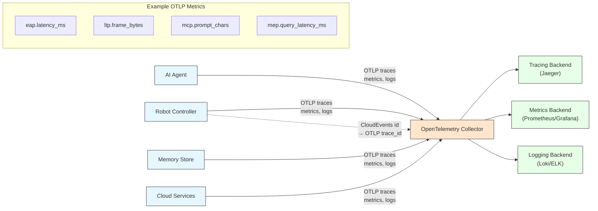

### 3.5. Perception Data Layer (L5)

This layer defines how the robot's sensory input is processed and transmitted for cognitive use.

#### 3.5.1. ROS 2 `sensor_msgs/*`

* **Context:** For raw sensor data (e.g., camera images, LiDAR scans, IMU data) that is directly consumed by lower-level robot control or pre-processing pipelines, ECPS re-uses standard ROS 2 `sensor_msgs/*` types.
* **Transport:** These messages are typically transported over DDS.
* **Role in ECPS:** While not part of the new ECPS envelopes, `sensor_msgs` serve as the source for data that will eventually be processed into latent tensors and transmitted via LTP.

#### 3.5.2. Latent Tensor Protocol (LTP v0.9)

* **Purpose:** Transports compressed N-dimensional arrays (tensors) representing latent embeddings or processed features derived from raw sensor data. This is crucial for efficient communication of high-dimensional perceptual states to AI agents.
* **Protobuf Definition:**
    ```protobuf
    message LTP {
      string  spec = "ltp/0.9";
      bytes   tensor_zstd = 1;      // zstd-compressed ND array
      repeated uint32 shape = 2;    // e.g. [B,L,D] for Batch, Length, Dimension
      string  dtype = 3;            // "f32" | "f16" | "u8" | ... (IEEE 754 float32, float16, unsigned 8-bit integer)
      string  frame_id = 4;         // Reference coordinate frame (e.g., "base_link", "camera_optical_frame")
      uint64  timestamp_ns = 5;     // Nanoseconds since Unix epoch
    }
    ```
* **Compression:** `tensor_zstd` MUST be zstd-compressed to minimize bandwidth.
* **Size Constraint:** LTP frames SHOULD remain $\le 1$ MiB to respect typical DDS fragment limits [R1]. Implementations generating larger tensors should consider splitting them or using alternative high-bandwidth transport mechanisms outside the standard 1MiB DDS limit.
* **Data Types:** `dtype` specifies the data type of the uncompressed tensor elements.

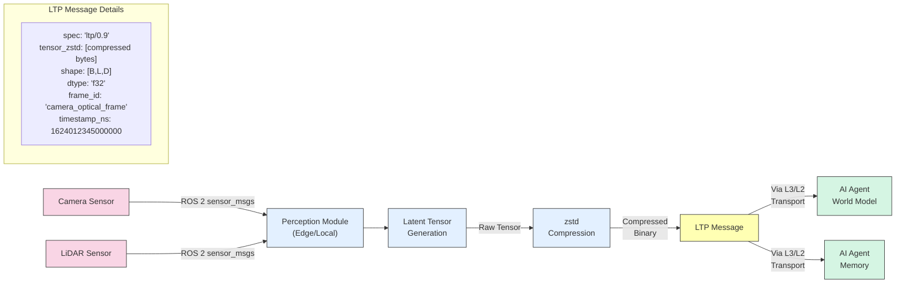

### 3.6. Cognition Layer (L6)

This layer defines the protocols for the AI agent's internal cognitive processes, particularly prompt delivery and memory management.

#### 3.6.1. Model Context Protocol (MCP v1.0)

* **Purpose:** Delivers natural-language prompts and optional tool schemas (function call definitions) into the AI agent's reasoning core (e.g., LLM, world model).
* **Protobuf Definition:**
    ```protobuf
    message MCP {
      string spec = "mcp/1.0";
      string id = 1;                  // CloudEvents id mirror
      string prompt = 2;              // ≤16 KiB UTF-8
      google.protobuf.Any tool_call = 3; // Optional, packs a Protobuf message representing a tool schema
      map<string, string> meta = 4;   // Arbitrary key-value metadata
    }
    ```
* **Prompt Size:** `prompt` field is limited to $\le 16$ KiB UTF-8 to manage context window sizes and network bandwidth. Gateways processing incoming prompts MUST return HTTP 413 (Payload Too Large) if this limit is exceeded (for HTTP-based transports).
* **Tool Schema:** `tool_call` allows dynamic definition of tools the agent can invoke. While described as a "JSON blob" conceptually, it is preferred to pack a dedicated Protobuf message within the `Any` type for strong typing and efficiency. If truly unstructured JSON, it should be serialized to a string or bytes field.

#### 3.6.2. Memory Exchange Protocol (MEP v1.0)

* **Purpose:** Provides a standardized interface for AI agents to store and query latent embeddings in a distributed memory store. This enables the agent to remember and retrieve past experiences or learned representations.
* **gRPC Service:** MEP is defined as a gRPC service for robust, stream-capable communication.
    ```protobuf
    service MemoryStore {
      rpc Put(LTP)                 returns (Ack); // Stores a latent tensor (embedding)
      rpc Query(QueryReq)          returns (stream LTP); // Queries for similar embeddings
    }

    message QueryReq {
      LTP query_embedding = 1;
      uint32 k = 2;              // Max number of embeddings to return
      float min_sim = 3;         // Minimum cosine similarity (0.0 to 1.0)
      // Additional query parameters MAY be added in minor versions (e.g., time range, frame_id filter)
    }

    message Ack {
      bool success = 1;
      string message = 2;
    }
    ```
* **Server Behavior:**
    * `Put`: Accepts an `LTP` message for storage. The server is responsible for decompressing the tensor, indexing it, and managing the memory (e.g., in a vector database).
    * `Query`: Accepts a `QueryReq` containing a query embedding and parameters. Servers MUST return at most `k` embeddings whose cosine similarity to the `query_embedding` is $\ge$ `min_sim`.
* **Eviction Policy:** LRU (Least Recently Used) eviction is RECOMMENDED for managing memory capacity. Other policies (e.g., semantic importance, temporal relevance) MAY be implemented.

#### 3.6.3. Agent-to-Agent (A2A) (Optional)

* **Context:** While not formally defined in ECPS v1.0, future versions or domain-specific extensions MAY include A2A communication, potentially based on FIPA ACL (Agent Communication Language), for coordination between multiple AI agents. This would operate within L6.

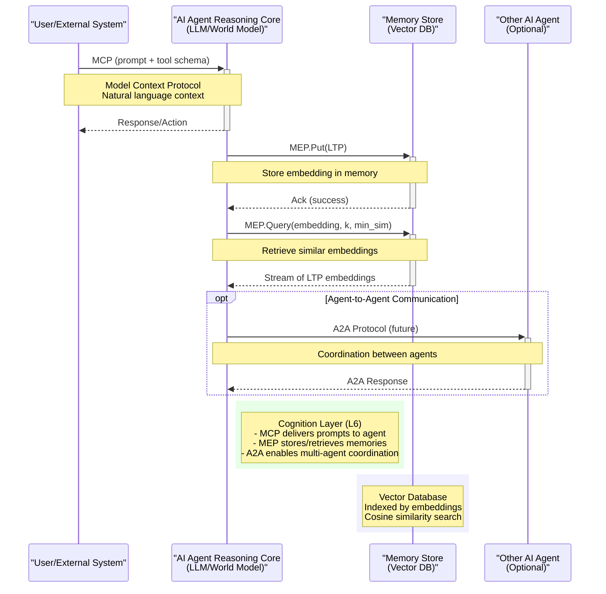

### 3.7. Actuation Layer (L7)

This layer formalizes the actions an AI agent can command the robot to perform.

#### 3.7.1. Embodied Action Protocol (EAP v0.1)

* **Purpose:** Encapsulates high-level commands for robot actuation, providing a unified action contract for various robot capabilities.
* **Protobuf Definition:**
    ```protobuf
    message EAP {
      string spec = "eap/0.1";
      string id = 1;                  // CloudEvents id mirror, unique action identifier
      bytes  state_sha = 2;           // SHA-256 of perceptual snapshot at time of action decision
      oneof body {                    // Only one action type can be present
        RobotPose set_pose = 10;
        GripperOp gripper = 11;
        CloudOp   cloud = 12;
        SimStep   sim = 13;
        // Future extensions will add more action types
      }
      map<string,string> meta = 20;    // Arbitrary key-value metadata (e.g., "safety":"stop_on_fail")
    }

    // Nested messages for EAP `oneof body` (defined in ecps.proto)
    message RobotPose { ... }
    message GripperOp { ... }
    message CloudOp { ... }
    message SimStep { ... }
    ```
* **`state_sha`:** This field is critical for deterministic replay. It MUST contain the SHA-256 hash of the perceptual snapshot (e.g., world model state, sensor data hash) that the AI agent used as the basis for making the action decision. This allows for rigorous auditing and reproduction of agent behavior.
* **`body` (Oneof):** Ensures that each EAP message specifies exactly one type of action.

#### 3.7.2. Actuation Bindings (ROS 2 Actions, OPC UA Robotics)

EAP messages are abstract and need to be mapped to concrete robot control interfaces.

* **Binding: DDS topic `eap`**
    * **Use-case:** Real-time local control.
    * **Notes:** Transport over DDS. QoS settings: Reliability=`RELIABLE`, History=`KEEP_LAST(4)` [R9].
    * **Mapping:** A local robot controller subscribes to this topic and translates the EAP body into direct joint commands, path planning requests, or other low-level actions.

* **Binding: gRPC POST `/v1/actions`**
    * **Use-case:** Cloud robot fleets, remote control.
    * **Notes:** Transport over gRPC/HTTP-2. Supports streaming of actions and back-pressure [R3].
    * **Mapping:** A cloud-based EAP service receives the POST request and dispatches it to the relevant robot agent or fleet manager.

* **Binding: ROS 2 Action relay**
    * **Use-case:** Long-running motion commands or complex behaviors.
    * **Notes:** EAP `body` is wrapped into standard ROS 2 Action feedback and result mechanisms (e.g., sending `RobotPose` as a goal for a `FollowJointTrajectory` action).
    * **Mapping:** A ROS 2 `eap_action_server` node accepts EAP messages as goals and translates them into native ROS 2 Action goals for other ROS 2 components (e.g., `MoveIt` planning, `Navigation2` tasks).

* **Binding: OPC UA Robotics [R8]**
    * **Use-case:** Industrial robots, interoperability with manufacturing execution systems (MES).
    * **Notes:** EAP actions are mapped to the standardized commands and data models defined in the OPC UA Robotics Companion specification.
    * **Mapping:** An OPC UA client/server component translates EAP messages into OPC UA method calls or variable writes on the robot's OPC UA server.

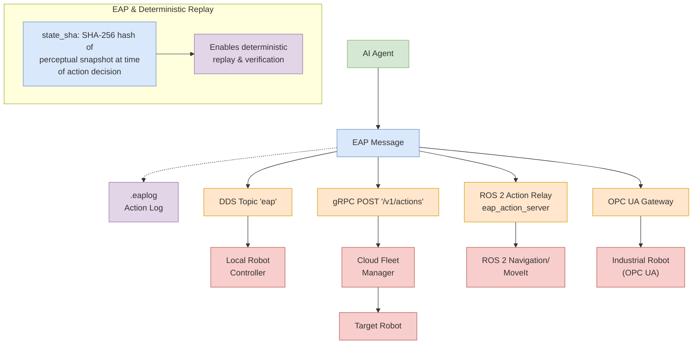

---

## 4. Cross-Cutting Concerns

### 4.1. Common Envelope Rules

These rules apply to all new ECPS envelopes (MCP, LTP, EAP) to ensure consistency and interoperability.

* **`spec` Attribute:** The `spec` attribute within each ECPS envelope MUST take the form `<name>/<major>.<minor>` (e.g., "mcp/1.0", "ltp/0.9", "eap/0.1"). This provides explicit versioning for each envelope type.
* **Encoding:** Binary Protobuf encoding MUST be offered as the primary serialization format. JSON encoding MAY be exposed for debugging purposes, but is not mandatory for production inter-operation. Protobuf consistently yields 5-6x speed and bandwidth advantages over JSON [R6].
* **Transport QoS:**
    * Envelopes transported via DDS SHALL set Reliability and Durability QoS according to [R1] & [R9].
    * Envelopes transported over gRPC SHALL use HTTP-2 streaming [R3] where continuous data flow is implied (e.g., MEP queries).
    * Envelopes transported over MQTT SHALL use QoS 1+ [R7] to ensure message delivery.

### 4.2. Deterministic Replay Mechanism

Deterministic replay is a cornerstone of ECPS, enabling rigorous auditing, debugging, and training of AI agents.

* **Action Logging:** Every sent EAP envelope MUST be appended to a binary `.eaplog` file. This log serves as a chronological record of all robot actions commanded by the AI agent.
* **Reproducibility:** Re-playing this `.eaplog` in a deterministic simulator (which precisely mimics the robot's kinematics, dynamics, and environmental interactions) MUST reproduce identical `state_sha` hashes for each corresponding action in the log.
* **CI/CD Integration:** Continuous Integration (CI) systems SHOULD fail if a replay of the `.eaplog` in a deterministic simulator diverges from the recorded `state_sha` hashes. This ensures that changes to the robot's control stack or simulator do not inadvertently break determinism.
* **Inspiration:** This principle is successfully employed in systems like Viam and other robotics replay engines [R10].

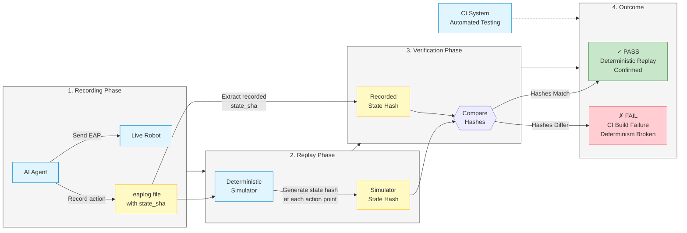

### 4.3. Security Architecture

Security is paramount, especially for embodied AI systems.

* **WAN Hops:** TLS 1.3 with mutual X.509 certificate authentication is REQUIRED on all WAN hops (e.g., gRPC over public internet, MQTT over cloud broker, DDS-Secure).
* **Cloud Operations:** EAP `CloudOp` bodies targeting external APIs (e.g., third-party web services) MUST include OAuth 2 bearer tokens in their `json_payload` as part of the `CloudOp` definition, ensuring secure access and authorization.
* **Data at Rest:** Logs containing `state_sha` (i.e., `.eaplog` files) MAY reveal scene fingerprints or sensitive environmental data. Therefore, `.eaplog` files MUST be encrypted at rest to protect privacy and intellectual property.

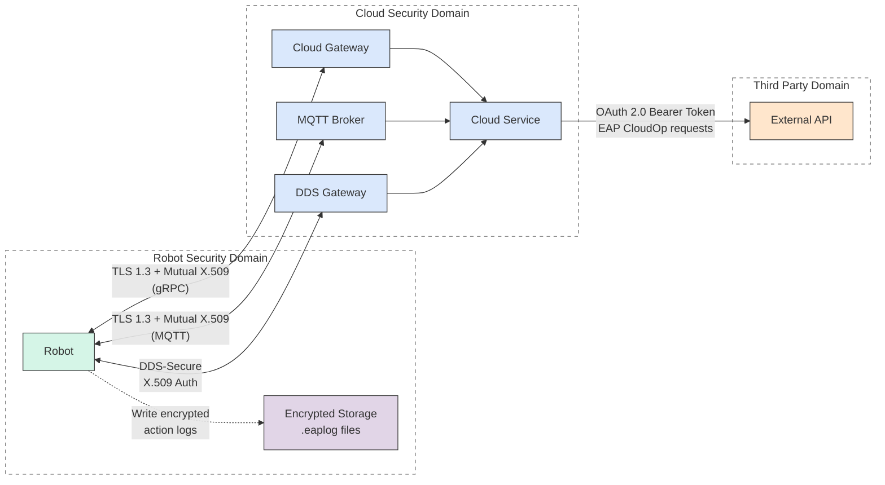

#### 4.3.1. Trust Layer Architecture

The ECPS Trust Layer provides a comprehensive security framework that can be applied transparently to all protocol layers in the stack. It is implemented as a cross-cutting concern that wraps the transport layer but influences all layers above it.

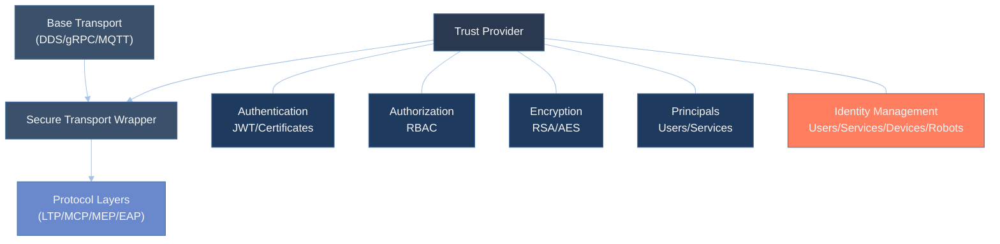

* **Trust Levels**: The trust layer operates at distinct security levels:

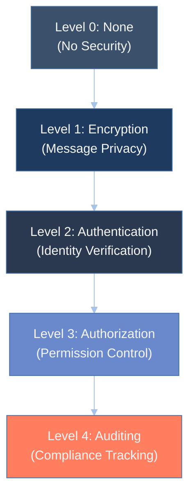

  * **None (L0)**: No security mechanisms active; suitable for development or isolated environments
  * **Encryption (L1)**: Message payloads are encrypted but no authentication
  * **Authentication (L2)**: Verifies identity of communicating parties through JWT or certificates
  * **Authorization (L3)**: Enforces permissions based on authenticated identities using RBAC
  * **Auditing (L4)**: Adds comprehensive logging of all security-relevant operations

* **Trust Mechanisms**: Multiple security mechanisms are supported:
  * **JWT (JSON Web Tokens)**: For stateless authentication with claims-based identity
  * **TLS**: For transport-level encryption and certificate-based authentication
  * **MTLS (Mutual TLS)**: For bidirectional certificate verification
  * **OAuth 2.0**: For delegated authorization scenarios

* **Principal Model**: Authenticated entities are represented as principals:
  * Each principal has a unique identifier and a set of attributes
  * Principals are assigned roles which grant specific permissions
  * Permissions are expressed as actions on resources (e.g., "publish:topic_name")
  * The RBAC system enables fine-grained access control across all protocol layers

* **Secure Message Envelope**: Messages are wrapped in a security envelope that provides:
  * Sender identification (principal ID)
  * Message timestamps for replay protection
  * Digital signatures for integrity verification
  * Encrypted payloads for confidentiality

* **Identity Management**: The trust layer includes a comprehensive identity system:

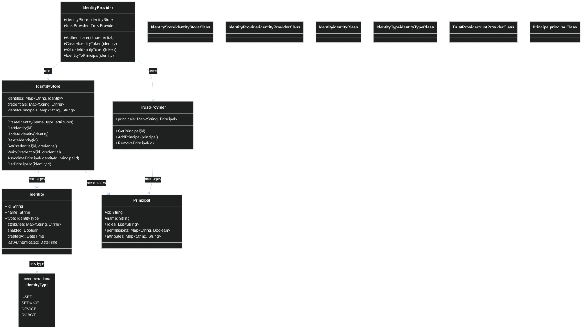

* **Integration with Protocol Layers**: The trust layer transparently secures all protocol layers:
  * **LTP**: Ensures tensor data confidentiality and authenticity
  * **MCP**: Verifies prompt sources and enforces access control on tool calls
  * **MEP**: Protects memory operations with proper authorization
  * **EAP**: Ensures only authorized entities can issue robot commands

Conforming implementations must support at least TrustLevel.AUTHENTICATION for production environments. Edge-Lite profile may operate at TrustLevel.ENCRYPTION where performance constraints apply.
### 4.4. Versioning & Compatibility Strategy

ECPS employs a clear versioning scheme to manage protocol evolution while preserving compatibility.

* **Minor Versions (`x.Y`):** A change in the minor version number (e.g., from `mcp/1.0` to `mcp/1.1`) indicates a backward-compatible update. Minor versions MAY add optional fields to existing messages without breaking older parsers. Older parsers will simply ignore the new optional fields.
* **Major Versions (`X.0`):** A change in the major version number (e.g., from `mcp/1.0` to `mcp/2.0`) indicates a breaking change. Major bumps MAY rename or remove fields, or fundamentally alter message semantics. Envelopes with newer major versions MUST be rejected by old parsers. Implementations MUST check the `spec` field for major version compatibility.

---

## 5. Conformance Profiles

ECPS defines specific conformance profiles to guide implementers and ensure interoperability for different deployment scenarios. Each profile specifies the mandatory ECPS layers and transport bindings. Implementations claiming a profile MUST pass the normative test vectors for that profile.

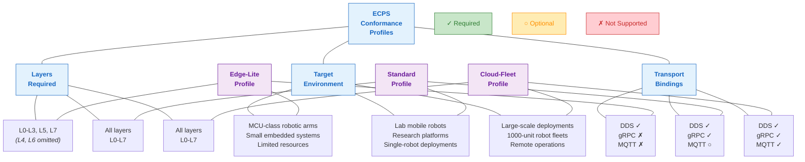

### 5.1. Edge-Lite Profile

* **Layers Required:** L0-L3, L5, L7.
* **Target Environment:** MCU-class robotic arms, small embedded systems with limited resources.
* **Transport Binding Focus:** Primarily DDS (for local real-time control) and potentially highly optimized Protobuf over serial links (though not explicitly listed as a transport, implied by "MCU-class").
* **Characteristics:** Prioritizes minimal footprint and direct control. Cognition (L6) and full observability (L4) may be offloaded to a more capable companion computer or cloud.

### 5.2. Standard Profile

* **Layers Required:** All layers (L0-L7).
* **Target Environment:** Lab mobile robots, research platforms, single-robot deployments with local compute.
* **Transport Binding Focus:** Primarily DDS for internal robot communication and gRPC/HTTP-2 for interaction with local computational resources (e.g., a local AI workstation). MQTT may be optional.
* **Characteristics:** Full stack implementation, suitable for developing and testing cognitive robotics applications in a controlled environment.

### 5.3. Cloud-Fleet Profile

* **Layers Required:** All layers (L0-L7) + MQTT binding.
* **Target Environment:** Large-scale deployments of 1000-unit robot fleets, remote operations, hybrid cloud/edge architectures.
* **Transport Binding Focus:** Supports DDS (for intra-robot), gRPC/HTTP-2 (for cloud-robot communication), and MQTT binding (for constrained IoT elements within the fleet or event-driven cloud integrations).
* **Characteristics:** Designed for scalability, robust remote management, and comprehensive observability across a distributed fleet.

### 5.4. Test Vectors & Validation

* **Normative Requirement:** Reference test vectors (as detailed in Appendix B of the ECPS v1.0 specification) are normative for claiming conformance to any profile.
* **Purpose:** These vectors provide machine-readable scenarios and expected outputs (e.g., valid/invalid messages, expected `state_sha` hashes upon replay) to ensure that independent implementations of ECPS are interoperable and behave as specified. CI pipelines SHOULD integrate these test vectors.

---

## 6. Appendices

### 6.1. JSON EAP Example

This example demonstrates how an EAP message *could* be represented in JSON for debugging purposes, assuming the optional JSON encoding is enabled. Note the CloudEvents attributes are included.

```json
{
  "spec":"eap/0.1",
  "id":"4d3a18e0-1f2a-4c3d-8e9f-0123456789ab", // Example CloudEvents id
  "state_sha":"1b9e0c5d2f8a1e7b6d5c4b3a2e1f0d9c8b7a6f5e4d3c2b1a0f9e8d7c6b5a4fe", // Example SHA-256
  "set_pose":{
    "x":0.42,
    "y":0.0,
    "z":0.25,
    "qw":0.707,
    "qx":0.0,
    "qy":0.707,
    "qz":0.0
  },
  "meta":{
    "safety":"stop_on_fail"
  },
  "datacontenttype":"application/cloudevents+json",
  "source":"urn:robot:arm1",
  "type":"eap.action.issued",
  "specversion":"1.0"
}
```

### 6.2. Detailed Protocol Buffer Definitions

This section would contain the complete and normative `.proto` file content, including all messages and services defined by ECPS. This is the source of truth for code generation.

```protobuf
// ecps.proto
syntax = "proto3";

package ecps;

import "google/protobuf/any.proto";
import "google/protobuf/timestamp.proto"; // Consider for timestamps if not using uint64 ns

// --- L6 Cognition: Model Context Protocol (MCP v1.0) ---
message MCP {
  string spec = "mcp/1.0"; // MUST take the form "mcp/1.0"
  string id = 1;           // CloudEvents id mirror
  string prompt = 2;       // ≤16 KiB UTF-8
  // tool_call as a JSON blob. It's best practice to define a specific Protobuf message
  // if the structure is known. For truly arbitrary JSON, use bytes or string.
  // Using bytes for raw JSON blob per original spec implies; client will parse.
  bytes tool_json = 3;     // Optional JSON blob representing tool schema, if any
  map<string, string> meta = 4;
}

// --- L5 Perception data: Latent Tensor Protocol (LTP v0.9) ---
message LTP {
  string  spec = "ltp/0.9"; // MUST take the form "ltp/0.9"
  bytes   tensor_zstd = 1;   // zstd-compressed ND array
  repeated uint32 shape = 2; // e.g. [B,L,D]
  string  dtype = 3;        // "f32" | "f16" | "u8" | ...
  string  frame_id = 4;     // Reference coordinate frame
  uint64  timestamp_ns = 5; // Nanoseconds since Unix epoch
}

// --- L6 Cognition: Memory Exchange Protocol (MEP v1.0) ---
service MemoryStore {
  rpc Put(LTP) returns (Ack);
  rpc Query(QueryReq) returns (stream LTP); // Servers MUST return at most k embeddings with cosine-sim >= min_sim.
}

message QueryReq {
  LTP query_embedding = 1;
  uint32 k = 2;              // Max number of embeddings to return
  float min_sim = 3;         // Minimum cosine similarity (0.0 to 1.0)
  // Potentially add range queries:
  // google.protobuf.Timestamp start_time = 4;
  // google.protobuf.Timestamp end_time = 5;
  // repeated string frame_ids = 6;
}

message Ack {
  bool success = 1;
  string message = 2;
}

// --- L7 Actuation: Embodied Action Protocol (EAP v0.1) ---
message EAP {
  string spec = "eap/0.1";
  string id = 1;                  // CloudEvents id mirror
  bytes  state_sha = 2;           // SHA-256 of perceptual snapshot

  oneof body {
    RobotPose set_pose = 10;
    GripperOp gripper = 11;
    CloudOp   cloud = 12;
    SimStep   sim = 13;
    // Add other action types here (e.g., NavigateTo, PickAndPlace, Manipulate)
  }

  map<string, string> meta = 20;    // "safety":"stop_on_fail", etc.
}

// Nested messages for EAP `oneof body`
message RobotPose {
  double x = 1;
  double y = 2;
  double z = 3;
  double qw = 4;
  double qx = 5;
  double qy = 6;
  double qz = 7;
  // For more complex poses, consider adding frame_id, and timestamp here if the pose itself has a specific temporal context
  // string frame_id = 8;
  // uint64 timestamp_ns = 9;
}

message GripperOp {
  enum GripperCommand {
    GRIPPER_COMMAND_UNSPECIFIED = 0;
    OPEN = 1;
    CLOSE = 2;
    GRIP = 3; // Attempt to grip with force feedback
  }
  GripperCommand command = 1;
  float position = 2; // e.g., 0.0 (closed) to 1.0 (open)
  float force_limit = 3; // e.g., in Newtons
}

message CloudOp {
  string api_name = 1; // e.g., "object_detection_service"
  string method_name = 2; // e.g., "detect_objects"
  bytes json_payload = 3; // JSON payload for external API (e.g., contains OAuth 2 bearer token)
  bool requires_oauth2 = 4; // Flag to indicate if OAuth 2 bearer token is implicitly expected in json_payload
}

message SimStep {
  double duration_s = 1; // Duration to step the simulation
  // Add specific simulation parameters like physics steps, render frames, etc.
  // uint32 physics_steps = 2;
}
```

### 6.3. Glossary

* **AI Agent:** A software entity embodying perception, memory, reasoning, and actuation capabilities, often powered by LLMs or world models.
* **CloudEvents:** A specification for describing event data in a common way.
* **DDS (Data Distribution Service):** A middleware standard for real-time publish-subscribe communication.
* **EAP (Embodied Action Protocol):** The ECPS envelope for robot actuation commands.
* **gRPC:** A high-performance, open-source universal RPC framework.
* **HTTP/2:** A major revision of the HTTP network protocol, providing multiplexing, header compression, and server push.
* **LLM (Large Language Model):** A type of AI model trained on vast amounts of text data.
* **LTP (Latent Tensor Protocol):** The ECPS envelope for transmitting compressed latent embeddings/tensors.
* **MCP (Model Context Protocol):** The ECPS envelope for delivering prompts and tool schemas to AI agents.
* **MEP (Memory Exchange Protocol):** The ECPS protocol/service for storing and querying latent memories.
* **MQTT:** A lightweight publish/subscribe messaging protocol, often used for IoT.
* **OTLP (OpenTelemetry Protocol):** A vendor-agnostic protocol for transmitting telemetry data.
* **Protobuf (Protocol Buffers):** Google's language-neutral, platform-neutral, extensible mechanism for serializing structured data.
* **QoS (Quality-of-Service):** Parameters defining the reliability, persistence, and delivery guarantees of messages in a communication system.
* **ROS 2 (Robot Operating System 2):** A flexible framework for writing robot software.
* **RTPS (Real-Time Publish-Subscribe):** The wire protocol used by DDS.
* **`state_sha`:** A SHA-256 hash of the perceptual snapshot, used for deterministic replay.
* **TLS (Transport Layer Security):** A cryptographic protocol for securing communication over a computer network.
* **World Model:** An AI component that learns and predicts the dynamics of an environment, enabling agents to reason about future states.
* **zstd:** A fast lossless compression algorithm.

---