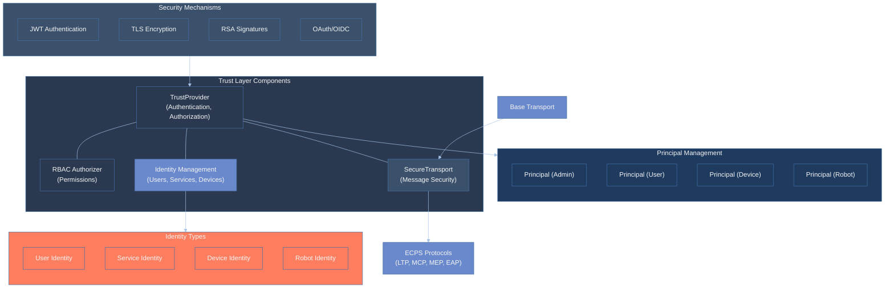
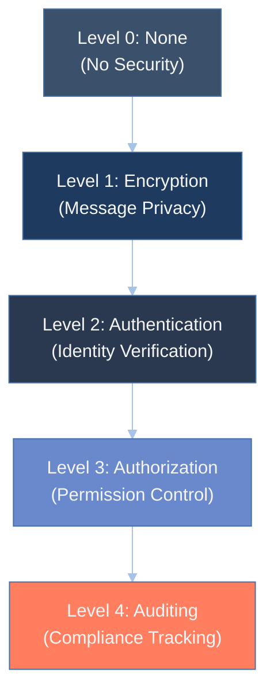
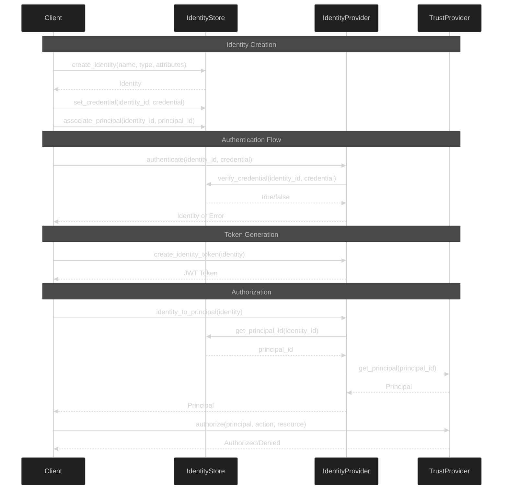
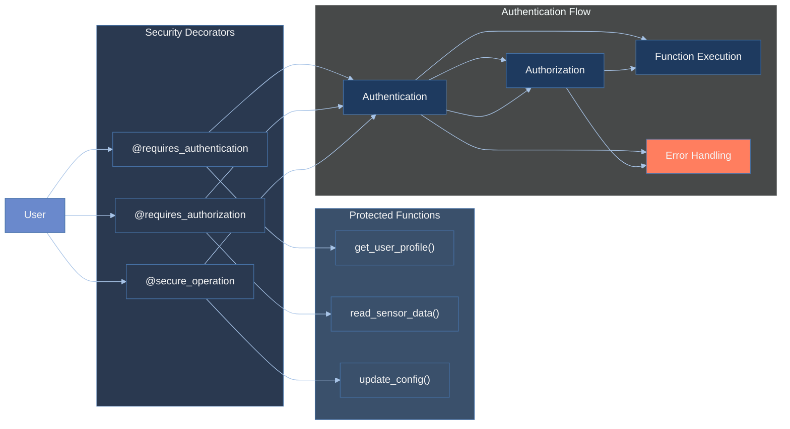

# ECPS: Embodied Cognition Protocol Stack for Agent and Robot Communication

ECPS-UV is a complete, high-performance Python/Go implementation of the Embodied Cognition Protocol Stack (ECPS) specification, utilizing the UV library for asynchronous I/O operations.

## Overview

The Embodied Cognition Protocol Stack (ECPS) is a complete, transport-agnostic protocol stack designed to facilitate sophisticated communication between AI-agent/world-model cognitive cores and physical or simulated robotic systems. It provides a deterministic, replayable, and auditable communication backbone, enabling AI agents to perceive, remember, reason, and act without reliance on external "oracles."

This SDK implements the full ECPS v1.0 specification using Python with UV for high-performance async I/O, providing a complete solution for developing ECPS-compliant systems.

## Features

- **Complete Implementation**: All layers of the ECPS specification are implemented:
  - Transport Layer (L2): DDS/RTPS, gRPC/HTTP-2, MQTT 5
  - Serialization & Event Envelope (L3): Protocol Buffers, CloudEvents 1.0
  - Observability (L4): OpenTelemetry integration
  - Perception Data (L5): LTP for efficient tensor transmission
  - Cognition (L6): MCP for prompts, MEP for memory operations
  - Actuation (L7): EAP for robot control commands
  - Trust Layer: Cross-cutting security and authentication

- **Multiple Transport Bindings**:
  - DDS/RTPS for real-time local control
  - gRPC/HTTP-2 for cloud/WAN communication
  - MQTT 5 for constrained IoT devices

- **Conformance Profiles**:
  - Edge-Lite Profile for constrained environments
  - Standard Profile for typical development
  - Cloud-Fleet Profile for large-scale deployments

- **High Performance**: Built on UV for efficient async I/O and networking
  
- **Deterministic Replay**: Support for action logging and replay via `.eaplog` files

- **Comprehensive Security**:
  - Authentication via JWT and certificate-based mechanisms
  - Authorization with role-based access control (RBAC)
  - Message encryption and integrity verification
  - **Hardware Security Integration**: TPM 2.0, HSM (PKCS#11), secure elements
  - **Hardware Attestation**: Device identity and platform attestation
  - **Secure Boot Validation**: Boot integrity verification
  - Graduated security levels for different deployment scenarios
  - Transparent security wrapper for all protocol layers

- **Advanced Logging**:
  - **Versioned Log Format**: Support for multiple log versions (V1.0-V2.1)
  - **Backward Compatibility**: Read legacy log formats seamlessly
  - **Migration Utilities**: Convert between log versions with full data preservation
  - **Rich Metadata**: Comprehensive log headers with robot ID, session ID, metadata
  - **Command-Line Tools**: Complete log management utility (`eaplog_tool.py`)

## Installation

```bash
pip install ecps-uv
```

For development installation:

```bash
git clone https://github.com/yourusername/ecps-uv.git
cd ecps-uv
pip install -e .
```

## Dependencies

- Python 3.8+
- UV
- Protocol Buffers
- gRPC
- Cyclone DDS
- Paho MQTT
- OpenTelemetry
- CloudEvents
- zstd
- NumPy
- PyJWT
- cryptography
- **Hardware Security (Optional)**:
  - python-tss (TPM 2.0 integration)
  - PyKCS11 (HSM/PKCS#11 support)
  - tpm2-tools (TPM command-line utilities)

## Quick Start

### Server Example

```python
import asyncio
import ecps_uv
from ecps_uv.core import StandardProfile

async def main():
    # Create server with Standard profile
    config = StandardProfile(transport_type="dds")
    server = ecps_uv.ECPSServer(config)
    
    # Define MCP handler
    async def handle_mcp(mcp_message):
        print(f"Received prompt: {mcp_message.prompt}")
    
    # Define EAP handler
    async def handle_eap(eap_message):
        if eap_message.HasField("set_pose"):
            pose = eap_message.set_pose
            print(f"Robot pose: x={pose.x}, y={pose.y}, z={pose.z}")
    
    # Register handlers
    server.on_mcp(handle_mcp)
    server.on_eap(handle_eap)
    
    # Start MEP service
    server.start_mep_service()
    
    # Start the server
    await server.start()
    
    # Keep server running
    try:
        while True:
            await asyncio.sleep(1)
    finally:
        await server.close()

if __name__ == "__main__":
    asyncio.run(main())
```

### Client Example

```python
import asyncio
import numpy as np
import ecps_uv
from ecps_uv.core import StandardProfile

async def main():
    # Create client with Standard profile
    config = StandardProfile(transport_type="dds")
    client = ecps_uv.ECPSClient(config)
    
    # Send MCP message
    prompt = "Move the robot arm to pick up the object"
    mcp_id = await client.send_mcp(prompt)
    print(f"Sent MCP message with ID: {mcp_id}")
    
    # Store memory embedding
    embedding = np.random.rand(1, 256).astype(np.float32)
    success, message = await client.store_memory(
        # LTP parameters would go here
    )
    
    # Send robot action
    pose_data = {
        "x": 0.5, "y": 0.3, "z": 0.2,
        "qw": 1.0, "qx": 0.0, "qy": 0.0, "qz": 0.0,
    }
    action_id = await client.send_action(
        action_type="set_pose",
        action_data=pose_data,
    )
    
    await client.close()

if __name__ == "__main__":
    asyncio.run(main())
### Go Server Example

```go
package main

import (
    "context"
    "log"
    "time"
    
    "github.com/ecps/ecps-go/pkg/actuation"
    "github.com/ecps/ecps-go/pkg/cognition"
    "github.com/ecps/ecps-go/pkg/core"
    "github.com/ecps/ecps-go/pkg/transport"
    "github.com/ecps/ecps-go/pkg/trust"
)

func main() {
    // Initialize transport
    transport, err := transport.NewMQTTTransport("localhost:1883")
    if err != nil {
        log.Fatalf("Failed to create transport: %v", err)
    }
    
    // Initialize trust provider
    trustProvider := trust.NewTrustProvider()
    if err := trustProvider.Initialize(); err != nil {
        log.Fatalf("Failed to initialize trust: %v", err)
    }
    
    // Create EAP handler with versioned logging
    eapHandler, err := actuation.NewEAPHandler(
        transport,
        core.NewProtobufSerializer(),
        core.NewTelemetry(),
        core.NewDefaultLogger(),
        actuation.WithLogDirectory("./logs"),
    )
    if err != nil {
        log.Fatalf("Failed to create EAP handler: %v", err)
    }
    
    // Create MCP handler
    mcpHandler := cognition.NewMCPHandler(transport)
    
    // Start listening for actions
    go func() {
        if err := eapHandler.ListenForActions(context.Background(), "robot/actions"); err != nil {
            log.Printf("EAP listener error: %v", err)
        }
    }()
    
    // Start listening for cognition requests
    go func() {
        if err := mcpHandler.ListenForRequests(context.Background(), "cognition/requests"); err != nil {
            log.Printf("MCP listener error: %v", err)
        }
    }()
    
    log.Println("ECPS Go server started")
    
    // Keep server running
    select {}
}
```

### Go Client Example

```go
package main

import (
    "context"
    "log"
    "time"
    
    "github.com/ecps/ecps-go/pkg/actuation"
    "github.com/ecps/ecps-go/pkg/cognition"
    "github.com/ecps/ecps-go/pkg/core"
    "github.com/ecps/ecps-go/pkg/transport"
)

func main() {
    // Initialize transport
    transport, err := transport.NewMQTTTransport("localhost:1883")
    if err != nil {
        log.Fatalf("Failed to create transport: %v", err)
    }
    
    // Create EAP handler
    eapHandler, err := actuation.NewEAPHandler(
        transport,
        core.NewProtobufSerializer(),
        core.NewTelemetry(),
        core.NewDefaultLogger(),
    )
    if err != nil {
        log.Fatalf("Failed to create EAP handler: %v", err)
    }
    
    // Create MCP handler
    mcpHandler := cognition.NewMCPHandler(transport)
    
    ctx := context.Background()
    
    // Send MCP request
    prompt := "Move the robot arm to pick up the object"
    mcpID, err := mcpHandler.SendRequest(ctx, prompt, map[string]interface{}{
        "model": "gpt-4",
        "temperature": 0.7,
    })
    if err != nil {
        log.Fatalf("Failed to send MCP request: %v", err)
    }
    log.Printf("Sent MCP request with ID: %s", mcpID)
    
    // Send robot action
    actionParams := actuation.ActionParams{
        Target:     "robot_arm",
        Parameters: map[string]interface{}{
            "x": 0.5, "y": 0.3, "z": 0.2,
            "qw": 1.0, "qx": 0.0, "qy": 0.0, "qz": 0.0,
        },
        Priority: 10,
        Timeout:  30000, // 30 seconds
    }
    
    actionID, err := eapHandler.PerformDirectAction(
        ctx,
        "robot_arm",
        "set_pose",
        actionParams.Parameters,
        nil, // payload
        actionParams.Timeout,
        actionParams.Priority,
        map[string]interface{}{"qos": "reliable"},
    )
    if err != nil {
        log.Fatalf("Failed to send action: %v", err)
    }
    log.Printf("Sent action with ID: %s", actionID)
    
    // Wait for responses
    time.Sleep(5 * time.Second)
    log.Println("Client completed")
}
```

### Go Hardware Security Example

```go
package main

import (
    "crypto/rand"
    "log"
    
    "github.com/ecps/ecps-go/pkg/trust"
)

func main() {
    // Initialize hardware security manager
    manager := trust.NewHardwareSecurityManager()
    if err := manager.Initialize(); err != nil {
        log.Fatalf("Failed to initialize hardware security: %v", err)
    }
    defer manager.Cleanup()
    
    provider := manager.GetActiveProvider()
    log.Printf("Using hardware security provider: %s", provider.GetHardwareType())
    
    // Generate hardware-backed device identity
    identity, err := provider.GenerateKey("robot_key")
    if err != nil {
        log.Fatalf("Failed to generate device identity: %v", err)
    }
    log.Printf("Device ID: %s", identity.DeviceID)
    log.Printf("Hardware Type: %s", identity.HardwareType)
    
    // Test signing and verification
    testData := []byte("Hello, ECPS-UV Hardware Security!")
    signature, err := provider.Sign("robot_key", testData)
    if err != nil {
        log.Fatalf("Failed to sign data: %v", err)
    }
    
    if err := provider.Verify("robot_key", testData, signature); err != nil {
        log.Fatalf("Signature verification failed: %v", err)
    }
    log.Println("✓ Signature verification successful")
    
    // Create hardware attestation
    nonce := make([]byte, 32)
    rand.Read(nonce)
    
    report, err := provider.CreateAttestation(nonce, trust.AttestationDeviceIdentity)
    if err != nil {
        log.Fatalf("Failed to create attestation: %v", err)
    }
    log.Printf("Attestation created for device: %s", report.DeviceID)
    
    // Verify attestation
    if err := provider.VerifyAttestation(report); err != nil {
        log.Fatalf("Attestation verification failed: %v", err)
    }
    log.Println("✓ Attestation verification successful")
}
```

### Go Log Versioning Example

```go
package main

import (
    "encoding/json"
    "log"
    "time"
    
    "github.com/ecps/ecps-go/pkg/actuation"
)

func main() {
    // Create versioned log with metadata
    robotID := "robot_001"
    sessionID := "mission_123"
    metadata := map[string]interface{}{
        "location": "warehouse_a",
        "mission":  "inventory_check",
    }
    
    writer := actuation.NewLogWriter(
        "robot_mission.eaplog",
        actuation.LogVersionV21,
        &robotID,
        &sessionID,
        metadata,
    )
    
    if err := writer.Open(); err != nil {
        log.Fatalf("Failed to create log: %v", err)
    }
    defer writer.Close()
    
    // Log actions with rich metadata
    for i := 0; i < 5; i++ {
        actionData := map[string]interface{}{
            "action_id":  i,
            "action":     "move_to_position",
            "target":     map[string]float64{"x": 1.5, "y": 2.0, "z": 0.0},
            "timestamp":  time.Now().Unix(),
        }
        
        actionJSON, err := json.Marshal(actionData)
        if err != nil {
            log.Fatalf("Failed to marshal action: %v", err)
        }
        
        if err := writer.WriteMessage(actionJSON); err != nil {
            log.Fatalf("Failed to write message: %v", err)
        }
    }
    
    log.Printf("Logged %d actions to versioned log", writer.GetMessageCount())
    
    // Read log with version detection
    reader := actuation.NewLogReader("robot_mission.eaplog")
    if err := reader.Open(); err != nil {
        log.Fatalf("Failed to open log: %v", err)
    }
    defer reader.Close()
    
    info, err := reader.GetInfo()
    if err != nil {
        log.Fatalf("Failed to get log info: %v", err)
    }
    
    log.Printf("Log version: %s", info["version"])
    log.Printf("Robot ID: %s", info["robot_id"])
    
    messages, err := reader.ReadMessages()
    if err != nil {
        log.Fatalf("Failed to read messages: %v", err)
    }
    log.Printf("Read %d messages from log", len(messages))
    
    // Migrate legacy logs to latest version
    migrator := actuation.NewLogMigrator()
    if err := migrator.MigrateFile(
        "legacy.eaplog",
        "updated.eaplog",
        actuation.LogVersionV21,
        &robotID,
        &sessionID,
        metadata,
    ); err != nil {
        log.Printf("Migration failed (legacy file may not exist): %v", err)
    } else {
        log.Println("✓ Successfully migrated legacy log to V2.1")
    }
}
```

## Installation

### Python Installation

```bash
pip install ecps-uv
```

For development installation:

```bash
git clone https://github.com/yourusername/ecps-uv.git
cd ecps-uv
pip install -e .
```

### Go Installation

```bash
go mod init your-project
go get github.com/ecps/ecps-go
```

For development:

```bash
git clone https://github.com/yourusername/ecps-uv.git
cd ecps-uv/ecps-go
go mod tidy
go build ./...
```

## Command-Line Tools

### Python EAP Log Tool

```bash
# Install the Python package first
pip install ecps-uv

# Use the eaplog tool
python -m ecps_uv.tools.eaplog_tool info robot.eaplog
python -m ecps_uv.tools.eaplog_tool validate robot.eaplog
python -m ecps_uv.tools.eaplog_tool migrate --source old.eaplog --target new.eaplog --version 2.1
```

### Go EAP Log Tool

```bash
# Build the Go tool
cd ecps-go
go build -o eaplog ./cmd/eaplog

# Use the tool
./eaplog info robot.eaplog
./eaplog validate robot.eaplog
./eaplog migrate -source old.eaplog -target new.eaplog -version 2.1
./eaplog list -file robot.eaplog -max 10
./eaplog create -file new.eaplog -version 2.1 -robot-id robot_001
```
```

## Complete Examples

### Python Examples

For complete Python examples, check the `examples/` directory:

- `examples/ecps_demo.py`: Demonstrates basic functionality
- `examples/secure_ecps.py`: Shows how to use the trust layer for secure communication
- `examples/hardware_security_demo.py`: **NEW** - Hardware security integration showcase
- `examples/identity_management_demo.py`: Identity and principal management
- `examples/trust_decorators_demo.py`: Trust decorators and security levels

### Go Examples

For complete Go examples, check the `ecps-go/examples/` directory:

- `ecps-go/examples/basic_client/main.go`: Basic Go client implementation
- `ecps-go/examples/basic_server/main.go`: Basic Go server implementation
- `ecps-go/examples/hardware_security_demo/main.go`: **NEW** - Complete hardware security showcase
- `ecps-go/examples/identity_management/main.go`: Identity and principal management
- `ecps-go/examples/secure_communication/main.go`: Secure communication with trust layer
- `ecps-go/examples/robot_assistant/main.go`: Robot assistant with cognitive capabilities

### Running Examples

**Python Examples:**
```bash
cd examples
python ecps_demo.py
python secure_ecps.py
python hardware_security_demo.py
```

**Go Examples:**
```bash
cd ecps-go/examples
go run ./basic_server
go run ./basic_client
go run ./hardware_security_demo
go run ./secure_communication
```

### Hardware Security Example

```python
from ecps_uv.trust.hardware_security import HardwareSecurityManager
import asyncio

async def hardware_security_demo():
    # Initialize hardware security manager
    manager = HardwareSecurityManager()
    await manager.initialize()
    
    # Get active provider (TPM, HSM, or software fallback)
    provider = manager.get_active_provider()
    print(f"Using: {provider.get_hardware_type()}")
    
    # Generate hardware-backed device identity
    identity = await provider.generate_key("robot_key")
    print(f"Device ID: {identity.device_id}")
    
    # Create hardware attestation
    nonce = secrets.token_bytes(32)
    report = await provider.create_attestation(nonce, "device_identity")
    print(f"Attestation created for device: {report.device_id}")
    
    # Verify attestation
    is_valid = await provider.verify_attestation(report)
    print(f"Attestation valid: {is_valid}")

asyncio.run(hardware_security_demo())
```

### Log Versioning Example

```python
from ecps_uv.actuation.log_versioning import LogWriter, LogReader, LogMigrator
import asyncio

async def log_versioning_demo():
    # Create versioned log with metadata
    writer = LogWriter(
        "robot_mission.eaplog",
        version=LogVersion.V2_1,
        robot_id="robot_001",
        session_id="mission_123",
        metadata={"location": "warehouse_a", "mission": "inventory"}
    )
    
    await writer.open()
    
    # Log actions with rich metadata
    action_data = {
        "action": "move_to_position",
        "target": {"x": 1.5, "y": 2.0, "z": 0.0},
        "timestamp": time.time()
    }
    await writer.write_message(json.dumps(action_data).encode())
    await writer.close()
    
    # Read log with version detection
    reader = LogReader("robot_mission.eaplog")
    await reader.open()
    
    info = await reader.get_info()
    print(f"Log version: {info['version']}")
    print(f"Robot ID: {info['robot_id']}")
    
    messages = await reader.read_messages()
    print(f"Found {len(messages)} actions")
    await reader.close()
    
    # Migrate legacy logs to latest version
    migrator = LogMigrator()
    await migrator.migrate_file(
        "legacy.eaplog",
        "updated.eaplog",
        LogVersion.V2_1,
        robot_id="migrated_robot"
    )

asyncio.run(log_versioning_demo())
### Go Hardware Security Example

```go
package main

import (
    "crypto/rand"
    "log"
    
    "github.com/ecps/ecps-go/pkg/trust"
)

func main() {
    // Initialize hardware security manager
    manager := trust.NewHardwareSecurityManager()
    if err := manager.Initialize(); err != nil {
        log.Fatalf("Failed to initialize hardware security: %v", err)
    }
    defer manager.Cleanup()
    
    // Get active provider (TPM, HSM, or software fallback)
    provider := manager.GetActiveProvider()
    log.Printf("Using: %s", provider.GetHardwareType())
    
    // Generate hardware-backed device identity
    identity, err := provider.GenerateKey("robot_key")
    if err != nil {
        log.Fatalf("Failed to generate device identity: %v", err)
    }
    log.Printf("Device ID: %s", identity.DeviceID)
    
    // Create hardware attestation
    nonce := make([]byte, 32)
    rand.Read(nonce)
    
    report, err := provider.CreateAttestation(nonce, trust.AttestationDeviceIdentity)
    if err != nil {
        log.Fatalf("Failed to create attestation: %v", err)
    }
    log.Printf("Attestation created for device: %s", report.DeviceID)
    
    // Verify attestation
    if err := provider.VerifyAttestation(report); err != nil {
        log.Fatalf("Attestation verification failed: %v", err)
    }
    log.Println("✓ Attestation verification successful")
}
```

### Go Log Versioning Example

```go
package main

import (
    "encoding/json"
    "log"
    "time"
    
    "github.com/ecps/ecps-go/pkg/actuation"
)

func main() {
    // Create versioned log with metadata
    robotID := "robot_001"
    sessionID := "mission_123"
    metadata := map[string]interface{}{
        "location": "warehouse_a",
        "mission":  "inventory_check",
    }
    
    writer := actuation.NewLogWriter(
        "robot_mission.eaplog",
        actuation.LogVersionV21,
        &robotID,
        &sessionID,
        metadata,
    )
    
    if err := writer.Open(); err != nil {
        log.Fatalf("Failed to create log: %v", err)
    }
    defer writer.Close()
    
    // Log actions with rich metadata
    for i := 0; i < 5; i++ {
        actionData := map[string]interface{}{
            "action_id":  i,
            "action":     "move_to_position",
            "target":     map[string]float64{"x": 1.5, "y": 2.0, "z": 0.0},
            "timestamp":  time.Now().Unix(),
        }
        
        actionJSON, err := json.Marshal(actionData)
        if err != nil {
            log.Fatalf("Failed to marshal action: %v", err)
        }
        
        if err := writer.WriteMessage(actionJSON); err != nil {
            log.Fatalf("Failed to write message: %v", err)
        }
    }
    
    log.Printf("Logged %d actions to versioned log", writer.GetMessageCount())
    
    // Read log with version detection
    reader := actuation.NewLogReader("robot_mission.eaplog")
    if err := reader.Open(); err != nil {
        log.Fatalf("Failed to open log: %v", err)
    }
    defer reader.Close()
    
    info, err := reader.GetInfo()
    if err != nil {
        log.Fatalf("Failed to get log info: %v", err)
    }
    
    log.Printf("Log version: %s", info["version"])
    log.Printf("Robot ID: %s", info["robot_id"])
    
    messages, err := reader.ReadMessages()
    if err != nil {
        log.Fatalf("Failed to read messages: %v", err)
    }
    log.Printf("Read %d messages from log", len(messages))
    
    // Migrate legacy logs to latest version
    migrator := actuation.NewLogMigrator()
    if err := migrator.MigrateFile(
        "legacy.eaplog",
        "updated.eaplog",
        actuation.LogVersionV21,
        &robotID,
        &sessionID,
        metadata,
    ); err != nil {
        log.Printf("Migration failed (legacy file may not exist): %v", err)
    } else {
        log.Println("✓ Successfully migrated legacy log to V2.1")
    }
}
```
```

## Architecture

The SDK is organized according to the ECPS layered model:

```
ecps_uv/
├── __init__.py          # Main package exports
├── core.py              # Client/Server implementations
├── transport/           # L2: Transport layer
│   ├── __init__.py
│   ├── base.py          # Transport interface
│   ├── dds.py           # DDS/RTPS binding
│   ├── grpc.py          # gRPC/HTTP-2 binding
│   └── mqtt.py          # MQTT 5 binding
├── serialization/       # L3: Serialization & envelope
│   ├── __init__.py
│   ├── protobuf.py      # Protocol Buffers serializer
│   └── cloudevents.py   # CloudEvents wrapper
├── observability/       # L4: Observability
│   ├── __init__.py
│   └── telemetry.py     # OpenTelemetry integration
├── perception/          # L5: Perception data
│   ├── __init__.py
│   └── ltp.py           # Latent Tensor Protocol
├── cognition/           # L6: Cognition
│   ├── __init__.py
│   ├── mcp.py           # Model Context Protocol
│   └── mep.py           # Memory Exchange Protocol
├── actuation/           # L7: Actuation
│   ├── __init__.py
│   ├── eap.py           # Embodied Action Protocol
│   └── log_versioning.py # **NEW** Versioned logging system
├── trust/               # Cross-cutting: Security
│   ├── __init__.py
│   ├── trust.py         # Trust provider and RBAC
│   ├── secure_transport.py # Secure message wrapper
│   ├── hardware_security.py # **NEW** Hardware security integration
│   ├── identity.py      # Identity management
│   └── decorators.py    # Security decorators
├── tools/               # **NEW** Command-line utilities
│   ├── __init__.py
│   └── eaplog_tool.py   # Log management utility
└── coordination/        # L6: Coordination layer
    ├── __init__.py
    └── consensus.py     # Consensus algorithms
```

### Go Implementation

The Go implementation (`ecps-go/`) provides full feature parity:

```
ecps-go/
├── go.mod               # Go module definition
├── pkg/                 # Go packages
│   ├── actuation/       # L7: Actuation layer
│   │   ├── eap.go       # Embodied Action Protocol
│   │   └── log_versioning.go # **NEW** Versioned logging
│   ├── trust/           # Security layer
│   │   ├── trust.go     # Trust provider
│   │   ├── identity.go  # Identity management
│   │   └── hardware_security.go # **NEW** Hardware security
│   ├── cognition/       # L6: Cognition layer
│   ├── coordination/    # L6: Coordination layer
│   ├── perception/      # L5: Perception layer
│   ├── observability/   # L4: Observability layer
│   ├── serialization/   # L3: Serialization layer
│   ├── transport/       # L2: Transport layer
│   └── core/           # Core interfaces
├── cmd/                # **NEW** Command-line tools
│   └── eaplog/         # Log management utility
├── examples/           # Go examples
│   ├── hardware_security_demo/ # **NEW** Hardware security demo
│   ├── basic_client/
│   ├── basic_server/
│   └── secure_communication/
└── tests/              # Go tests
    ├── log_versioning_test.go # **NEW** Log versioning tests
    └── hardware_security_test.go # **NEW** Hardware security tests
```

## Roadmap

The ECPS UV SDK is under active development. Here's our roadmap for future enhancements:

### Recently Completed ✅
- ✅ **Hardware Security Integration**: TPM 2.0, HSM (PKCS#11), secure elements
- ✅ **Versioned Logging System**: Multi-version log support (V1.0-V2.1)
- ✅ **Command-Line Tools**: Complete log management utilities
- ✅ **Go-Python Parity**: Full feature parity between implementations
- ✅ **Hardware Attestation**: Device identity and platform attestation
- ✅ **Migration Utilities**: Backward compatibility and log conversion

### Near-term (Q3 2025)
- Add additional transport implementations (WebSocket, ZeroMQ)
- Enhanced hardware security provider implementations
- Improve documentation and add comprehensive API references
- Add performance benchmarking tools and profiles
- Advanced log compression and encryption options

### Mid-term (Q4 2025)
- Implement transport auto-discovery and failover
- Add zero-copy optimizations for tensor operations
- Create a visualization tool for ECPS message flows
- Implement batch operations for improved efficiency
- Integration with external key management systems (AWS KMS, Azure Key Vault)

### Long-term (2026)
- Support for federated trust models across multiple devices
- Advanced fleet management capabilities
- Enhanced security features (formal verification, compliance certifications)
- Support for embedded/constrained environments
- Cross-language interoperability testing framework

## Trust Layer Implementation

The ECPS SDK provides a comprehensive trust layer for securing communications across all protocol layers.

### Trust Layer Architecture



### Security Levels

The trust layer implements graduated security levels to meet different deployment needs:



### Core Components

- **TrustProvider**: The central security service that manages authentication, authorization, and encryption
  - Supports multiple trust levels (None, Encryption, Authentication, Authorization, Auditing)
  - Handles key management (RSA) for cryptographic operations
  - Provides JWT token generation and validation
  - Manages principal identities with associated roles and permissions

- **Principal Model**: Representation of authenticated entities
  - Identity management with unique IDs
  - Role-based access control
  - Attribute-based policies
  - Fine-grained permissions for resources

- **SecureTransport**: Transparent security wrapper for any transport implementation
  - Message signing for integrity verification
  - Encryption for confidentiality
  - Authentication token handling
  - Principal validation

- **RBAC Authorizer**: Role-based access control implementation
  - Permission management by role
  - Action/resource permission model
  - Support for wildcard permissions
  - Integration with trust provider

- **Identity Management**: Complete identity system for managing authentication entities
  - Support for different identity types (User, Service, Device, Robot)
  - Credential storage and verification
  - Token generation and validation
  - Identity lifecycle management (create, update, disable, delete)
  - Association between identities and principals

### Identity Management



The ECPS SDK provides a comprehensive identity management system that works with the trust layer:

```python
from ecps_uv.trust import (
    Identity, IdentityStore, IdentityProvider, IdentityType,
    create_default_identity_provider
)

# Create identity store and provider
identity_store = IdentityStore()
identity_provider = IdentityProvider(
    identity_store=identity_store,
    jwt_secret="your-secret-key",
)

# Create different types of identities
user = identity_store.create_identity(
    name="John Doe",
    type=IdentityType.USER,
    attributes={"email": "john@example.com"},
)
identity_store.set_credential(user.id, "user-password")
identity_store.associate_principal(user.id, "user1")

# Authenticate an identity
identity = await identity_provider.authenticate(user.id, "user-password")
if identity:
    # Create identity token
    token = identity_provider.create_identity_token(identity)
    
    # Get associated principal
    principal_id = await identity_provider.identity_to_principal(identity)
```

For a complete example, see `examples/identity_management_demo.py`.

### Python Decorator API



The Python SDK provides a powerful decorator-based security API that makes it easy to add authentication and authorization checks to any function:

```python
from ecps_uv.trust import (
    requires_authentication,
    requires_authorization,
    secure_operation,
    AuthenticationError,
    AuthorizationError,
)

# Authentication only
@requires_authentication(trust_provider)
async def get_user_profile(principal):
    # Only executed if principal is authenticated
    return {...}

# Authorization check
@requires_authorization(trust_provider, "read", "sensor_data")
async def read_sensor_data(principal, sensor_id):
    # Only executed if principal can "read" on "sensor_data"
    return {...}

# Combined decorator for convenience
@secure_operation(trust_provider, "write", "config")
async def update_config(principal, config_name, value):
    # Only executed if principal can "write" on "config"
    return {...}
```

The decorators work with both synchronous and asynchronous functions and handle:
- Principal authentication
- Permission checking
- Proper error handling with descriptive exceptions
- Converting string IDs to principal objects automatically

For a complete example, see `examples/trust_decorators_demo.py`.

### Basic Usage Examples

```python
# Setting up a trust provider with authentication and authorization
trust_provider = TrustProvider(
    trust_level=TrustLevel.AUTHORIZATION,
    mechanisms=[TrustMechanism.JWT, TrustMechanism.TLS],
    jwt_secret="your-secret-key",
    private_key_path="path/to/private_key.pem",
    public_key_path="path/to/public_key.pem",
)

# Creating and adding a principal
admin_principal = Principal(
    id="admin1",
    name="Administrator",
    roles=["admin"],
    permissions={"publish:topic": True},
    attributes={"department": "IT"},
)
trust_provider.add_principal(admin_principal)

# Creating a secure transport
base_transport = DDSTransport()
secure_transport = trust_provider.secure_transport(base_transport)

# Using the secure transport with MCP
mcp_handler = MCPHandler(secure_transport, serializer, None)
```

For a complete example, see `examples/secure_ecps.py`.

## License

MIT License

## Contributing

Contributions are welcome! Please feel free to submit a Pull Request.
